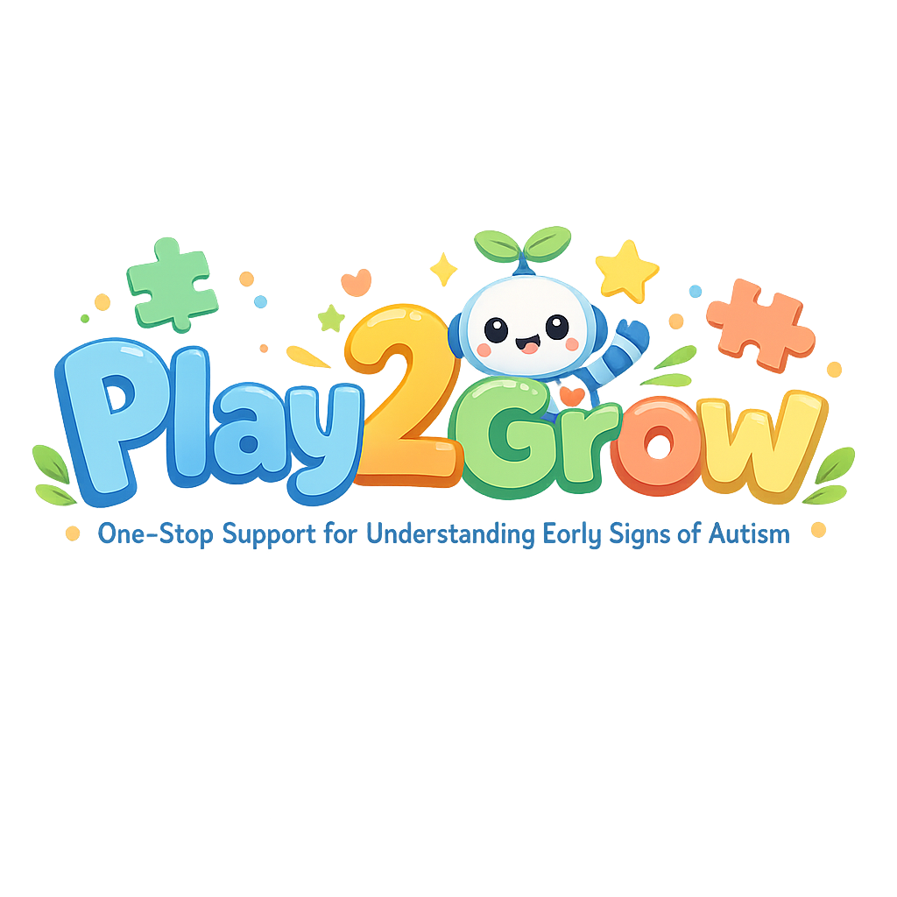

# Play2Grow - Early Autism Screening for Kids 🌟

<p align="center">
  
</p>

## About
**Play2Grow** is a child-friendly, interactive web application designed to support the **early detection of Autism Spectrum Disorder (ASD)**. By turning screening into a fun and engaging experience with games, we help parents and caregivers gain valuable insights into their child's development in a stress-free environment.

## 🎮 Key Features

### 1. Interactive Games (Screening Tools)
*   **👀 Eye Tracking Game:** Uses **WebGazer.js** to track visual attention and "pursuit" accuracy directly in the browser (no hardware needed!).
*   **👆 Finger Tapping:** Measures motor skills and reaction speeds.
*   **🧠 Memory Match:** Evaluates working memory and cognitive focus.
*   **😆 Emoji Quiz:** Tests emotion recognition and social cue understanding.
*   **🔴 Ball Clicker:** Assesses fine motor control and responsiveness.

### 2. Parent Dashboard & Support
*   **📊 Visual Analytics:** View progress through interactive **Bar and Pie Charts**.
*   **📈 Risk Profile:** Get an AI-driven overview of potential risk factors labeled as "Risk" or "No Risk" indicators.
*   **👨‍⚕️ Contact Doctor:** Find and contact specialists directly. View profiles, fees, and available slots for psychologists and therapists in your area.
*   **📝 Detailed Reports:** Export results to Excel and send reports directly to doctors.

### 3. Child-Friendly Design
*   **🎨 Visual System:** Pastel colors, rounded UI, and a friendly Robot Mascot to keep children engaged.
*   **🏆 Gamification:** Avatars, scores, and positive reinforcement ("You did great!").
*   **🔒 Safe & Secure:** Secure login and privacy-focused data handling.

---

## 🛠️ Technologies Used
*   **Frontend:** React.js (Vite), Material UI (MUI)
*   **Eye Tracking:** WebGazer.js
*   **Charts:** Chart.js, React-Chartjs-2
*   **Backend/Auth:** Firebase
*   **AI Insights:** Google Gemini API

---

## 🚀 Getting Started

Follow these steps to set up and run the project locally:

### Prerequisites
*   Node.js (v14 or higher)
*   npm or yarn

### Installation

1.  **Clone the repository:**
    ```sh
    git clone <repository-url>
    cd Autism-Detector-main
    ```

2.  **Install dependencies:**
    ```sh
    npm install
    ```

3.  **Start the development server:**
    ```sh
    npm start
    ```
    *(Note: This project now uses **Vite** for faster development. The server will typically start at `http://localhost:5173`)*

4.  **Open in Browser:**
    Visit `http://localhost:5173` to start playing!

---

## ⚠️ Important Disclaimer
**Play2Grow is a screening tool, NOT a medical diagnosis.**
Results generated by this application should be used as a reference to consult with qualified healthcare professionals (pediatricians, child psychologists) for proper evaluation.

---

Made with ❤️ for little minds.
